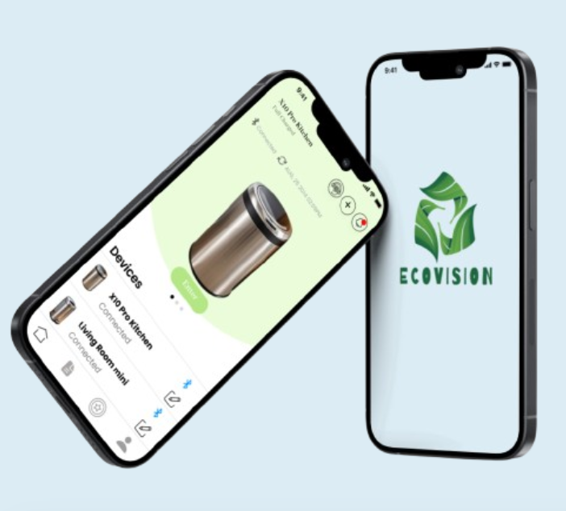

# Figma_Projects

Welcome to my GitHub projects repository! Below are descriptions and links to my key projects:

---

## 1. **رفيق (Rafiq)** 
 

A mobile application linked to a smart cup that helps users accurately track their fluid intake.  
### Features:  
- **Smart Tracking**: Automatically calculates fluid consumption via Bluetooth or manual entry, retaining data during disconnection.  
- **Nutritional Management**: Helps users manage their nutritional needs based on health status, BMI, and chronic diseases.  
- **Meal Tracking**: Tracks meals and calculates important nutrients like sodium, potassium, phosphorus, and protein.  
- **Health Improvement**: Provides recommendations for nutrient intake and sends alerts when limits are exceeded.  

### Link to Project:  
[رفيق GitHub Repository](https://www.figma.com/proto/jfZ56tgUJ0hzpunKZUb2fs/%D8%B1%D9%81%D9%8A%D9%82?node-id=0-1&t=sHshDDkcjODUkEDy-1)

---

## 2. **Ecovision** 

  
  

A mobile application for controlling and monitoring smart bins via Bluetooth.  
### Features:  
- **Smart Bin Monitoring**: Notifies users when the bin is full and tracks garbage collection schedules.  
- **Statistics**: Provides insights into the most disposed of items, such as glass or plastic.  
- **Rewards System**: Users earn points and receive notifications for sustainable waste management practices.  

### Link to Project:  
[Ecovision GitHub Repository](https://www.figma.com/proto/LWwfOQDyJeMBU6cDkjlNRD/Ecovision?node-id=116-717&t=2Ecqbg9Rv0h7bdfI-1)

---

